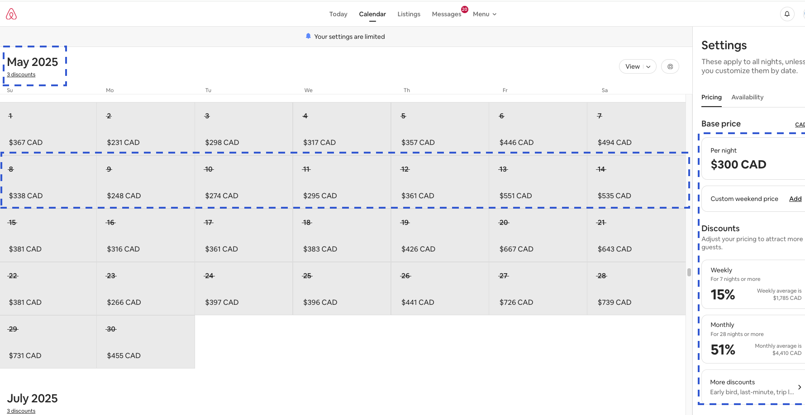
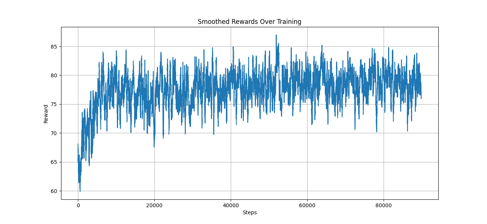

<h2> AirBnB Dynamic Weekly Pricing using Deep -RL </h2>

 Rewards Results

<h2>Use Cases for Reinforcement Learning Applications in E-commerce</h2>

<ul>
  <li>
    <h3>Dynamic Pricing</h3>
    RL can adjust product prices dynamically based on demand, competitor prices, inventory levels, and user behavior. 
    <strong>State:</strong> Current inventory, competitor pricing, user demand trends, seasonality. 
    <strong>Action:</strong> Adjust the product price. 
    <strong>Reward:</strong> Maximizing profit while maintaining customer satisfaction and avoiding stockouts. 
  </li>
  <li>
    <h3>Personalized Product Recommendations</h3>
    RL can improve recommendation systems by optimizing for long-term user engagement rather than just immediate clicks. 
    <strong>State:</strong> User browsing history, preferences, and interactions. 
    <strong>Action:</strong> Suggest a product or a bundle of products. 
    <strong>Reward:</strong> Click-through rate, add-to-cart rate, purchase conversion, or user session length. 
  </li>
  <li>
    <h3>Inventory Management</h3>
    RL can optimize stock levels across warehouses and stores to minimize holding costs and avoid stockouts. 
    <strong>State:</strong> Current inventory levels, demand forecasts, shipping constraints. 
    <strong>Action:</strong> Reorder quantities or reallocate stock between locations. 
    <strong>Reward:</strong> Cost savings from efficient inventory management. 
  </li>
  <li>
    <h3>Marketing Campaign Optimization</h3>
    Optimize advertising strategies to improve return on ad spend (ROAS) and user engagement. 
    <strong>State:</strong> User behavior metrics, ad performance data, time of day. 
    <strong>Action:</strong> Select which ad to show, adjust bid amounts. 
    <strong>Reward:</strong> Increased conversions, click-through rates, or engagement metrics. 
  </li>
  <li>
    <h3>Customer Service Optimization</h3>
    RL can improve customer support bots or live agent assistance by learning the best strategies to resolve user issues. 
    <strong>State:</strong> Customer sentiment, inquiry type, prior interaction history. 
    <strong>Action:</strong> Select appropriate responses or escalate to human support. 
    <strong>Reward:</strong> Resolution rate, customer satisfaction scores, and reduced handling time. 
  </li>
  <li>
    <h3>Warehouse Management</h3>
    Optimize the picking, packing, and shipping process in warehouses. 
    <strong>State:</strong> Item locations, order queue, and worker availability. 
    <strong>Action:</strong> Assign tasks (e.g., which items to pick first). 
    <strong>Reward:</strong> Minimized time to fulfill an order. 
  </li>
  <li>
    <h3>Loyalty and Retention Strategies</h3>
    Maximize customer lifetime value (CLV) by determining the best retention offers or loyalty rewards. 
    <strong>State:</strong> User purchase history, engagement level, likelihood of churn. 
    <strong>Action:</strong> Provide discounts, loyalty points, or personalized offers. 
    <strong>Reward:</strong> Increased retention and repeat purchases. 
  </li>
  <li>
    <h3>Search and Ranking Optimization</h3>
    Optimize the ordering of search results to increase click-through and purchase rates. 
    <strong>State:</strong> User search query, browsing history, product popularity. 
    <strong>Action:</strong> Rank the products displayed in search results. 
    <strong>Reward:</strong> Click-through rates, conversions, or average order value (AOV). 
  </li>
  <li>
    <h3>Fraud Detection and Prevention</h3>
    Detect fraudulent activities in real time and take corrective actions. 
    <strong>State:</strong> Transaction history, user behavior patterns, anomaly scores. 
    <strong>Action:</strong> Approve, flag, or deny a transaction. 
    <strong>Reward:</strong> Reduced fraudulent activity while minimizing false positives. 
  </li>
  <li>
    <h3>Supply Chain Optimization</h3>
    Streamline the supply chain by optimizing routing, scheduling, and vendor selection. 
    <strong>State:</strong> Shipping costs, vendor reliability, inventory levels. 
    <strong>Action:</strong> Choose suppliers, shipping methods, or distribution schedules. 
    <strong>Reward:</strong> Reduced costs and improved delivery times. 
  </li>
</ul>

<h2>Reinforcement Learning Applications in Healthcare</h2>

<ul>
  <li>
    <h3>Personalized Treatment Planning</h3>
    RL can optimize personalized treatment strategies based on patient data. 
    <strong>State:</strong> Patient history, symptoms, and test results. 
    <strong>Action:</strong> Recommend specific treatments or dosages. 
    <strong>Reward:</strong> Improved patient outcomes and minimized side effects. 
  </li>
  <li>
    <h3>Hospital Resource Management</h3>
    RL can efficiently allocate hospital resources like beds, staff, and equipment. 
    <strong>State:</strong> Current hospital occupancy, patient inflow, and resource availability. 
    <strong>Action:</strong> Reallocate resources dynamically. 
    <strong>Reward:</strong> Reduced patient wait times and optimized resource usage. 
  </li>
  <li>
    <h3>Drug Discovery</h3>
    RL can accelerate the drug discovery process by simulating molecular interactions. 
    <strong>State:</strong> Molecular properties, target characteristics. 
    <strong>Action:</strong> Modify chemical structures or choose simulation paths. 
    <strong>Reward:</strong> Identifying effective compounds with fewer experiments. 
  </li>
</ul>
